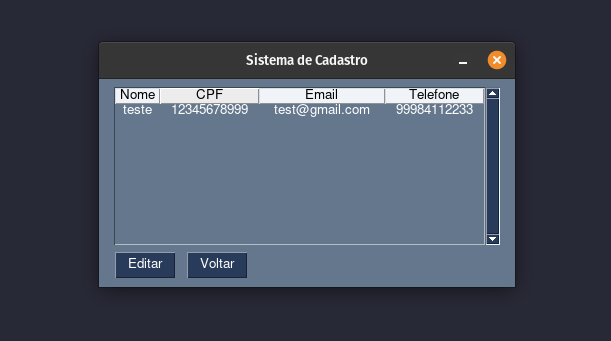

### Sistema de Cadastro 

Um sistema simples, feito com o banco de dados sqlite3 e PySimpleGUI para inserção e ediçao de dados; Nome, CPF, Email e Telefone.

#### Bibliotecas necessarias: 


Primeiro crie um ambiente virtual para instalar as dependências

#### Unix

```
python3 -m venv <venv>

source <venv>/bin/activate

python3 -m pip install pysimplegui

```

#### Windows 

```
c:\>Python35\python -m venv c:\path\to\myenv

PS C:\> <venv>\Scripts\Activate.ps1

py -m pip install pysimplegui
```

Tela de cadastro

!!\[Alt text\](image.png)

Lista de Usuários




